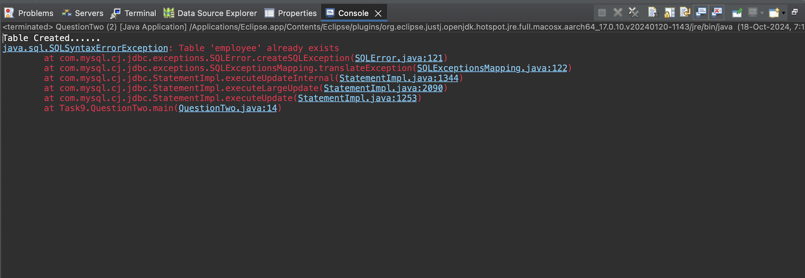

# SQL + JDBC + MongoDB Tasks


A structured repository with SQL queries, JDBC operations, and
MongoDB tasks. This project uses MySQL, Java, and MongoDB.

## Project Structure

```
sql-jdbc-mongodb-tasks/
│── .github/workflows/
│── screenshots/
│── 1.sql
│── MyDatabaseConnection.java
│── QuestionTwo.java
│── MONGODB TASK.docx
│── README.md
│── LICENSE
```

## Task 1 — SQL Queries (MySQL)

### Screenshots

#### Full Table Output


#### Salary ≥ 2200


#### Employees With NULL Commission


#### Salary Not Between 2500 and 4000


#### No Manager


#### Name With 'A' as 3rd Letter


#### Name Ending With 'T'


#### Final SQL Script


## Task 2 — JDBC Program

### Connection Class



### Output


## Task 3 — MongoDB Queries

Queries are included in `MONGODB TASK.docx`.

## How to Run

### SQL

```sql
mysql -u root -p
use tasks;
source 1.sql;
```

### Java

```bash
javac MyDatabaseConnection.java QuestionTwo.java
java MyDatabaseConnection
java QuestionTwo
```

### MongoDB

```bash
mongoimport --db mydatabase --collection products --file product.json --jsonArray
```

## License

MIT License.
